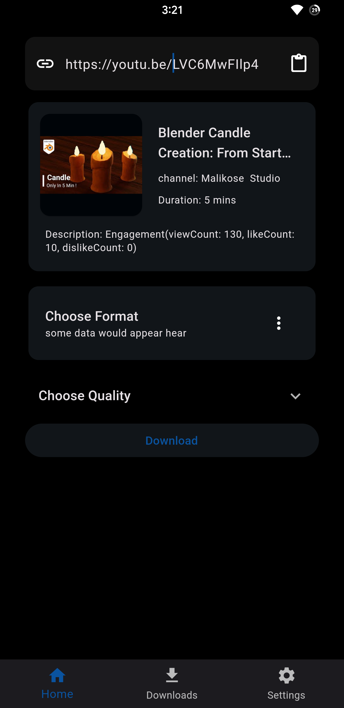

# Introducing YTD: The Advanced YouTube Video Downloader

<!--  -->

YTD is a powerful YouTube video downloader app built with Flutter. It integrates the `youtube_explode` library for fetching video download links and utilizes the HTTP package for efficient HTTP requests. With YTD, you can effortlessly select desired formats, qualities, and customize the download path. The app also offers seamless management of your download history. 

Impress employers with your technical skills and expertise in developing robust Android apps by showcasing YTD in your portfolio.

For help getting started with Flutter development, view the
[online documentation](https://docs.flutter.dev/), which offers tutorials,
samples, guidance on mobile development, and a full API reference.
